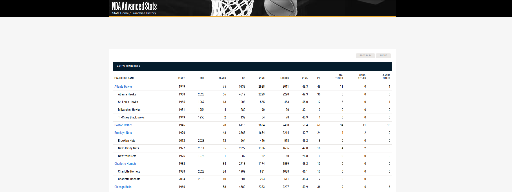

# WebScrapperNBA



## Overview
WebScrapperNBA is a Python-based web scraping tool designed to collect and analyze data from the NBA website. This project aims to provide users with easy access to historical franchise data and statistics.

## Features
- Scrapes NBA franchise history and statistics.
- Outputs data in a CSV format for easy analysis.

## Getting Started

### Prerequisites
- Python 3.x
- Libraries: `requests`, `beautifulsoup4`, `pandas`

### Installation
1. Clone the repository:
   ```bash
   git clone https://github.com/bishos123/WebScrapperNBA.git
   cd WebScrapperNBA
2. Install Requirements:
   ```bash
   pip install requests beautifulsoup4 pandas
3. Run script:
   ```bash
   python Web_scrapper_NBA.py

The scraped data will be saved in df_franchise_history.csv, at same directory.

## License

This project is licensed under the MIT License - see the LICENSE file for details.

## Acknowledgments

*BeautifulSoup* for HTML parsing.
*Pandas* for data manipulation.
   
